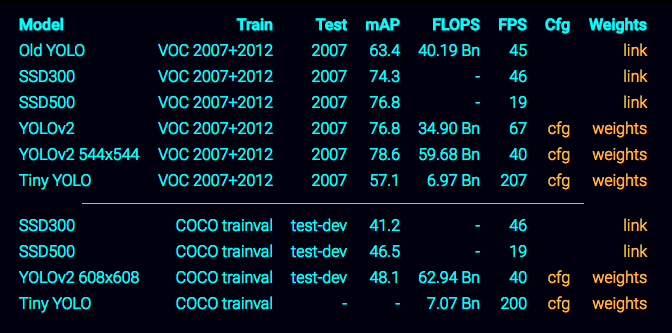
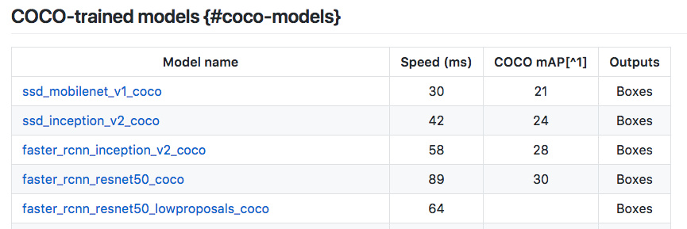

# Traffic Light Detection and Classification

## Steps to follow
1. Get enough data
2. Labeling dataset 
3. Select Pretrained Models
4. Train Models
5. Optimize Models (speed, size)

### 1. Get enough data
+ Udacity Dataset: 
    + Real data (150 samples)
    + Sim data (260 samples)
+ Bosch Small Traffic Lights Dataset: 
    + Training set: 
      + 5093 images
      + 10756 annotated traffic lights
    + Test set:
      + 8334 consecutive images
      + 13486 annotated traffic lights
    + 4 labels (red, yellow, green, off)
    + 2088 lights are partially occluded

### 3. Select Pretrained Models

We must select the faster models:

+ YOLO : https://pjreddie.com/darknet/yolo/

+ Tensorflow model zoo: https://github.com/tensorflow/models/blob/master/research/object_detection/g3doc/detection_model_zoo.md
  + SSD : 
    + ssd_mobilenet_v1_coco
    + ssd_inception_v2_coco
  + Faster :
    + faster_rcnn_inception_v2_coco
    + faster_rcnn_resnet50_coco

### 2. Labeling dataset 
**Udacity Dataset annotated by Anthony Sarkis**

### 4. Models

#### 4.1 Convert raw dataset to TFRecord for object_detection.
+ Ref code: 
https://github.com/tensorflow/models/blob/master/research/object_detection/dataset_tools/create_pascal_tf_record.py
https://github.com/tensorflow/models/blob/master/research/object_detection/create_pascal_tf_record.py
https://github.com/tensorflow/models/tree/master/research/object_detection/data

#### 4.2 Setup object detection pipeline
+ Ref code: 
https://github.com/tensorflow/models/blob/master/research/object_detection/g3doc/configuring_jobs.md

#### 4.3 Data Augmentation

#### 4.3 Train Models

### 5. Optimize Models (Speed, size)

(To be continued ;)

------------------

### Research
Some teams have made the classification model using only OpenCV.... 
OpenCV pros:
It'll be faster but with lower accuracy. It'll be enough? 
More easy to test.

### References:
https://medium.freecodecamp.org/recognizing-traffic-lights-with-deep-learning-23dae23287cc
https://becominghuman.ai/traffic-light-detection-tensorflow-api-c75fdbadac62
https://medium.com/@anthony_sarkis/self-driving-cars-implementing-real-time-traffic-light-detection-and-classification-in-2017-7d9ae8df1c58
https://pjreddie.com/darknet/yolo/

### Repos
https://github.com/coldKnight/TrafficLight_Detection-TensorFlowAPI
https://github.com/swirlingsand/deeper-traffic-lights
https://github.com/allanzelener/YAD2K
https://github.com/experiencor/basic-yolo-keras

### Datasets
+ Udacity Dataset : 
+ Bosch Small Traffic Lights Dataset: https://hci.iwr.uni-heidelberg.de/node/6132

### Tools to Dataset Annotation
https://github.com/tzutalin/labelImg
http://sloth.readthedocs.io/en/latest/index.html