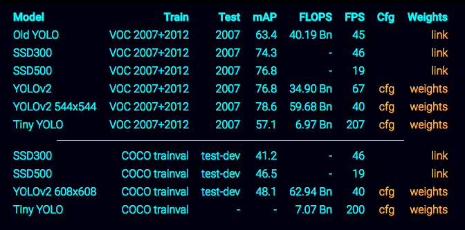
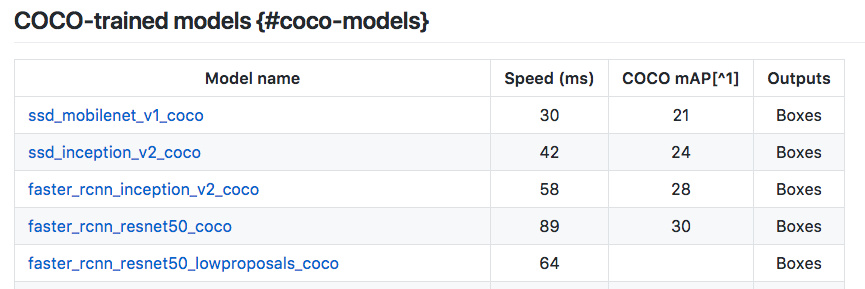
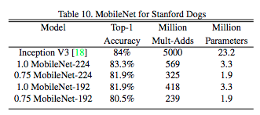

# Traffic Light Detection and Classification

We evaluate different approaches to solve the traffic light classification task:

1. Object (traffic light) detection and classification using FCN models like YOLO, SSD.
2. Classification of the entire image using CNN  with a light&fast model like MobileNet.

## Steps to follow
1. Get enough data
2. Labeling dataset 
3. Select Pretrained Models
4. Train Models
5. Optimize Models (speed, size)

### 1. Get enough data
+ Udacity Dataset: 
    + Real data (~2400 samples)
    + Sim data (~775 samples)
+ Bosch Small Traffic Lights Dataset: 
    + Training set: 
      + 5093 images
      + 10756 annotated traffic lights
    + Test set:
      + 8334 consecutive images
      + 13486 annotated traffic lights
    + 4 labels (red, yellow, green, off)
    + 2088 lights are partially occluded

### 3. Select Pretrained Models

We must select the faster models:

#### 3.1.Object (traffic light) detection and classification using FCN models
##### 3.1.1. YOLO : https://pjreddie.com/darknet/yolo/

##### 3.1.2. Tensorflow model zoo https://github.com/tensorflow/models/blob/master/research/object_detection/g3doc/detection_model_zoo.md  
  + SSD : 
    + ssd_mobilenet_v1_coco
    + ssd_inception_v2_coco
  + Faster :
    + faster_rcnn_inception_v2_coco
    + faster_rcnn_resnet50_coco

#### 3.2. Classification of the entire image using CNN  with a light&fast model like MobileNet
##### 3.2.1 MobileNet
MobileNets are optimized to run very efficiently (high FPS, low memory footprint). 
MobileNets are prepared to work on mobile and embedded devices.

### 2. Labeling dataset 
Udacity Dataset annotated by Anthony Sarkis

### 4. Models

For this project, we select a MobileNet model because:  
+ We only need to know if traficc light is red or not.  
  + To drive Carla (Sim & Real), this prediction is enough.
+ MobileNet is a fast model.
 
We select a MobileNet model from TensorFlow pretained models:
+ MobileNet_v1_1.0_224
https://github.com/tensorflow/models/blob/master/research/slim/nets/mobilenet_v1.md

MobileNet models have been trained on the ILSVRC-2012-CLS image classification dataset.
We need to retrain the model with our dataset.

### 4.1.PIPELINE for MobileNet Model.

+ Resize input image to (224,224)
+ Normalize image
+ Reshape to model input (1, 224,224,3)

#### 4.2 Data Augmentation
During training we have tested several combinations of:
    - flip_left_right
    - random_brightness
    - random_crop
    - random_scale

#### 4.3 Train Models

We retrain the model the new labels none and red.
We use a mix of images from simulator Udacity and from real (rosbag).  
+ Number of Images:  
  + none : 2219  
  + red : 911  
+ Optimizer : GradientDescentOptimizer with a low learning rate.

**We get a final test accuracy of 94.5%**

### 5. Optimize Models (Speed, size)

MobileNets are optimized to work on mobile and embedded devices.

Results from Speed Tests: 

+ Speed Test 1:
  + Machine: MacBook Pro. 2.9 GHz Intel Core i7
  + Total Evaluation time (100-images):      17.082s
  + Average evaluation time (17.082/100):    0.171s

+ Speed Test 2:
  + Machine: Ubuntu 16.04. x86_64. Intel(R) Core(TM) i7-6700K CPU @ 4.00GHz. GeForce GTX 1070
  + Total Evaluation time (100-images):	     3.767s
  + **Average evaluation time (3.767/100):	 0.038s**

+ Speed Test 3:
  + Machine: Oracle VirtualBox Machine. Ubuntu-64.
  + Total Evaluation time (100-images):	    29.917s
  + Average evaluation time (29.917/100):	 0.299s

------------------

### Research
Some teams have made the classification model using only OpenCV.... 
OpenCV pros:
It'll be faster but with lower accuracy. It'll be enough? 
More easy to test.

### References:
https://medium.freecodecamp.org/recognizing-traffic-lights-with-deep-learning-23dae23287cc  
https://becominghuman.ai/traffic-light-detection-tensorflow-api-c75fdbadac62  
https://medium.com/@anthony_sarkis/self-driving-cars-implementing-real-time-traffic-light-detection-and-classification-in-2017-7d9ae8df1c58  
https://pjreddie.com/darknet/yolo/  

### Repos
+ Object Detection & classification  
https://github.com/coldKnight/TrafficLight_Detection-TensorFlowAPI
https://github.com/swirlingsand/deeper-traffic-lights
https://github.com/allanzelener/YAD2K
https://github.com/experiencor/basic-yolo-keras

+ Object Classification  
https://github.com/olegleyz/traffic-light-classification

### Datasets
+ Udacity Dataset : 
+ Bosch Small Traffic Lights Dataset: https://hci.iwr.uni-heidelberg.de/node/6132

### Tools to Dataset Annotation
https://github.com/tzutalin/labelImg
http://sloth.readthedocs.io/en/latest/index.html

### MobileNets
https://arxiv.org/pdf/1704.04861.pdf
https://research.googleblog.com/2017/06/mobilenets-open-source-models-for.html
https://github.com/googlecodelabs/tensorflow-for-poets-2/

--------------------------------

### 4.1.PIPELINE for Object (traffic light) detection and classification using FCN models like YOLO, SSD.
For this project, we don't use FCN models 

#### 4.1.1 Convert raw dataset to TFRecord for object_detection.
+ Repo: 
https://github.com/tensorflow/models/blob/master/research/object_detection/dataset_tools/create_pascal_tf_record.py  
https://github.com/tensorflow/models/blob/master/research/object_detection/create_pascal_tf_record.py  
https://github.com/tensorflow/models/tree/master/research/object_detection/data  

#### 4.1.2 Setup object detection pipeline
+ Repo: 
https://github.com/tensorflow/models/blob/master/research/object_detection/g3doc/configuring_jobs.md

#### 4.1.3 Data Augmentation
+ Tensorflow API 
  + Inside ssd_inception_v2_coco.config, we define data_augmentation_options {}. There multiple options define inside preprocessor_builder.py  (PREPROCESSING_FUNCTION_MAP)   
  Ref: https://github.com/tensorflow/models/blob/a4944a57ad2811e1f6a7a87589a9fc8a776e8d3c/object_detection/builders/preprocessor_builder.py  
  Apply several combinations of:
    - flip_left_right
    - random_brightness
    - random_crop
    - random_scale

#### 4.3 Train Models

#### 4.3.1 Using Tensorflow API 
1. Inception SSD v2
Ref: https://github.com/tensorflow/models/blob/master/research/object_detection/samples/configs/ssd_inception_v2_coco.config  
+ For Simulator Data
  + model.ckpt :: 
+ For Real Data
  + model.ckpt ::

### 5. Optimize Models (Speed, size)

(To be continued ;)